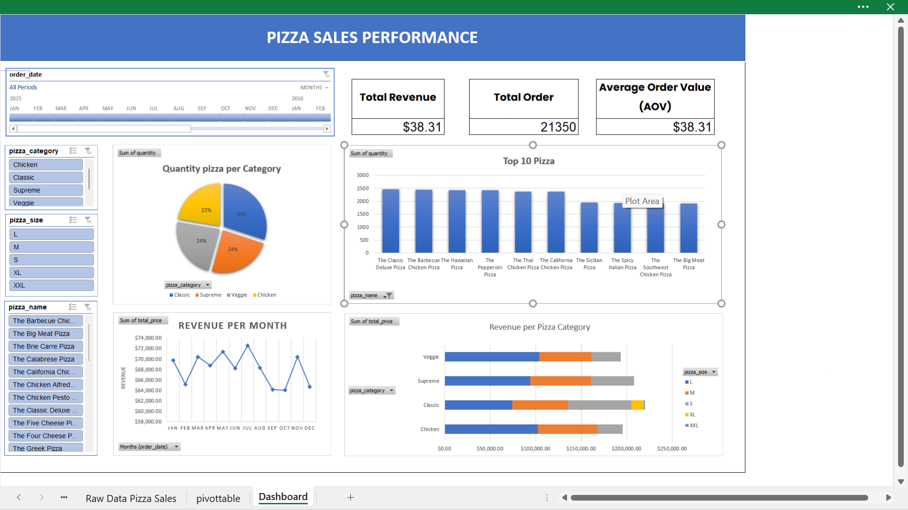

# 🍕 Pizza Sales Dashboard (Microsoft Excel)

Dashboard ini dibuat menggunakan **Microsoft Excel** untuk menganalisis data penjualan pizza berdasarkan dataset *Pizza Sales*.  
Tujuan dashboard ini adalah untuk membantu mengidentifikasi performa penjualan, tren pembelian, dan produk terlaris.

---

## 📊 Fitur Utama

- **Pivot Table & Chart:** Analisis interaktif untuk menampilkan total penjualan, order, dan revenue.  
- **Visualisasi Tren Penjualan:** Line chart dan bar chart untuk menunjukkan pola pembelian per bulan/hari.  
- **Category Breakdown:** Analisis penjualan berdasarkan kategori pizza (Classic, Supreme, Veggie, Chicken).  
- **Best & Worst Seller:** Identifikasi pizza paling laris dan paling rendah penjualannya.  
- **Slicer Interaktif:** Filter data berdasarkan kategori, ukuran pizza, dan periode waktu.

---

## 🚀 Cara Menggunakan

1. **Download file** `pizza_sales.xlsx`.  
2. **Buka di Microsoft Excel.**  
3. Gunakan **Slicer / Filter** yang tersedia untuk mengeksplorasi data.  
4. Untuk melihat tampilan statis, buka file `pizza_sales.pdf`.  

---

## 🧠 Insight Utama

- Kategori **Classic Pizza** memberikan kontribusi penjualan tertinggi.  
- Ukuran **L (Large)** menyumbang revenue terbesar.  
- Penjualan meningkat pada **akhir pekan (Jumat–Minggu)**.  
- Menu dengan harga menengah memiliki tingkat penjualan tertinggi dibandingkan pizza premium.  

---

## 📁 File yang Disertakan

| Nama File | Deskripsi |
|------------|-----------|
| `pizza_sales.xlsx` | File utama dashboard Excel |
| `pizza_sales.pdf` | Export dashboard ke format PDF |
| `images/dashboard_preview.png` | Screenshot tampilan dashboard |
| `README.md` | Dokumentasi proyek |

---

## 🧩 Dataset
Dataset sumber: *Pizza Sales Dataset* (bisa ditemukan di Kaggle atau file ini sudah terintegrasi di dalam dashboard Excel).

---

## 👨‍💻 Pembuat
**Akhmad Ikmal Zulfa**  
[GitHub Profile](https://github.com/AkhmadIkmalZulfa)

---

## 🏷️ Tag
`Excel Dashboard` · `Data Visualization` · `Sales Analysis` · `Pizza Sales` · `Pivot Table`
